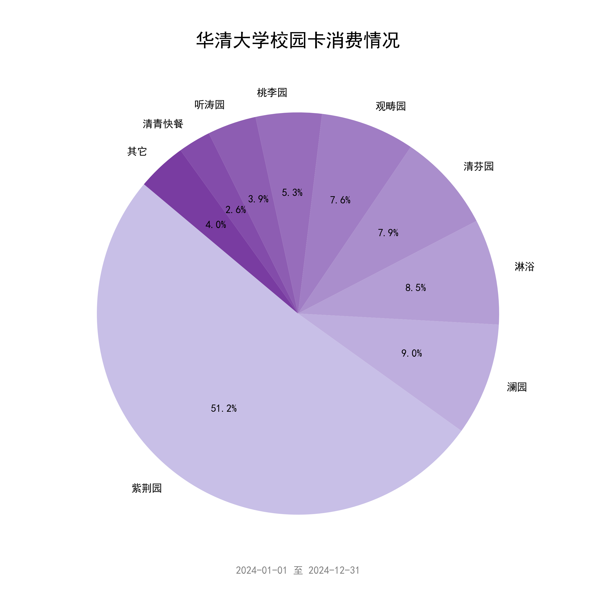

# THU-Annual-Eat-Pie

一年过去了，你在华子食堂里花的钱都花在哪儿了？

## 项目简介

本项目是一个用于统计华清大学学生在食堂（和宿舍）的消费情况的脚本。通过模拟登录华清大学校园卡网站，获取学生在华子食堂的消费记录，并通过饼状图的方式展示。

- 合并了同一食堂内的窗口
- 隐藏了宿舍楼号
- 支持隐藏具体金额
- 支持自定义饼图配色
- 支持自定义起止日期



## 使用方法

### 0. 安装依赖

本项目依赖于 `requests`、`matplotlib` 和 `pycryptodome`，请确保你的 Python 环境中已经安装了这些库。

```bash
pip install requests matplotlib pycryptodome
```

> 你可能需要在 `Python\Python312\Lib\site-packages` 目录下将 `crypto` 文件夹改名为 `Crypto`。


### 1. 获取服务代码

首先，登录[华清大学校园卡网站](https://card.tsinghua.edu.cn/userselftrade)。


`F12` 打开开发者工具，切换到 Network（网络）标签页，然后 `Ctrl + R` 刷新页面，找到 `userselftrade` 这个请求，查看标头中的 `Cookie` 字段，其中包含了你的服务代码。

服务代码是 `servicehall=` **之后**的一串字符（不含 `servicehall=`）。


### 2. 保存账号信息

新建 `./config/account.json` 文件，输入你的学号、密码、服务代码。

```json
{
    "idserial": "你的学号",
    "password": "你的密码",
    "servicehall": "你的服务代码"
}
```

### 3. 运行脚本

```bash
python main.py
```
保存饼状图 `result_pie.png`。

> 你可能需要下载SimHei字体，或者更换为环境中已有的中文字体。

### 4. 其它配置（可选）

修改 `config.json` 文件，自定义起止时间、配色、是否显示具体金额。

```json
{
    "start_date": "2024-01-01",
    "end_date": "2024-12-31",
    "color": [
        ["颜色1", "颜色2", "..."], #  默认取第一组配色
    ],
    "show_numbers": false # 是否显示具体金额
}
```

## Acknowledgement
- Idea来源：http://xhslink.com/a/8VLkrNIQ3S41
- 原版代码（柱状图+显示具体窗口）：https://github.com/leverimmy/THU-Annual-Eat

## LICENSE

除非另有说明，本仓库的内容采用 [CC BY-NC-SA 4.0](https://creativecommons.org/licenses/by-nc-sa/4.0/) 许可协议。在遵守许可协议的前提下，您可以自由地分享、修改本文档的内容，但不得用于商业目的。

如果您认为文档的部分内容侵犯了您的合法权益，请联系项目维护者，我们会尽快删除相关内容。
